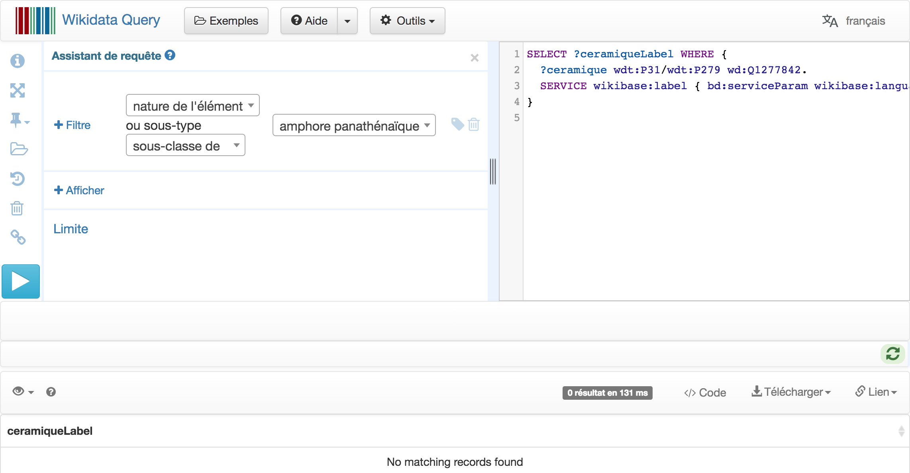
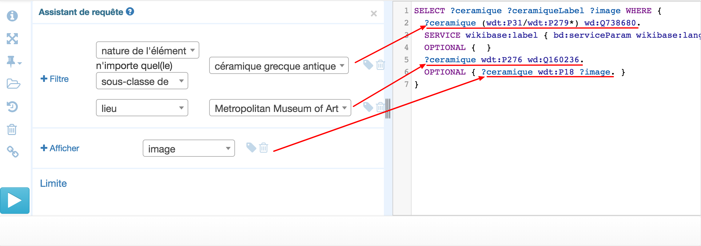
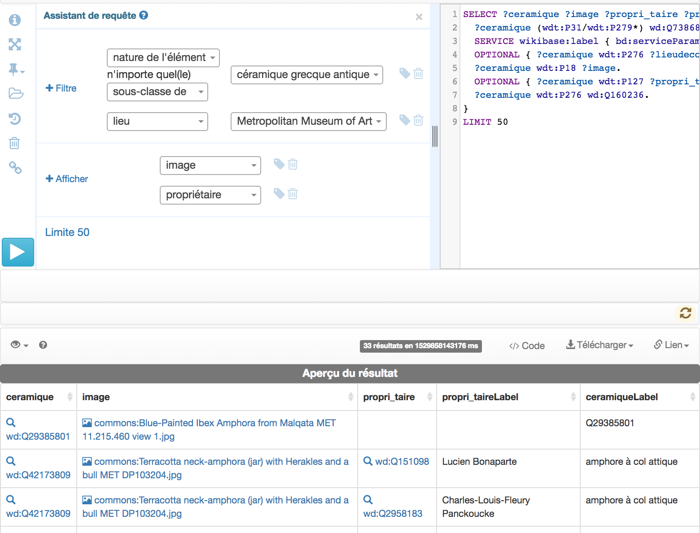

## Tutoriel "pas-pas" pour créer un corpus avec wikidata
réalisé dans le cadre du workshop “fabriquer des jeux de données en art” du 28 au 30 mai 2018 à l'INHA

> **Important avant toute chose** : si on ne trouve pas dans WD tous les éléments dont on a besoin pour sa recherche, alors il convient d’enrichir les données directement dans WD !

### introduction
**Wikidata** est une base de données libre, collaborative, multilingue, et secondaire qui collecte des données structurées pour alimenter Wikipédia, Wikimedia Commons, les autres projets du mouvement Wikimédia et pour n'importe qui sur la planète.

Pour en savoir + sur wikidata, lecture hautement recommendée de https://www.wikidata.org/wiki/Wikidata:Introduction/fr

### Démarche

Se rendre sur le sparqlendpoint de Wikidata : https://query.wikidata.org/

Voici à quoi ressemble l'interface :


**Wikidata** propose deux modes pour rédiger des requêtes :
* via un assistant (bloc de gauche de l’écran) : formulaire, avec le libellé des concepts
* via la fenêtre de saisie classique (bloc de droite de l’écran) : requête littérale à rédiger en langage sparql

Dans tous les cas, un conseil : partir d’un exemple de requête préenregistrée *(bouton “Exemples”)*.
> NB : Il est recommandé de n’utiliser le mode assistant sur la partie gauche de la page uniquement pour des requêtes très simples, car toutes les fonctionnalités du langage SPARQL ne sont pas accessibles via les champs de l’assistant.

Deux sources pour "appréhender" les requêtes SPARQL :
* [Page web contenant des exemples de requêtes SQARQL  pour Wikidata](https://www.wikidata.org/wiki/Wikidata:SPARQL_query_service/queries/examples)
* [La page web tutoriel SQARQL pour un usage sur Wikidata est aussi utile](https://www.wikidata.org/wiki/Wikidata:SPARQL_tutorial)

### Formaliser sa question pour la transformer en requête :

**Quelles informations/champs est-ce que je veux récupérer (zone “afficher”) ?**

La démarche de SPARQL consiste à poser des filtres successifs qui permettent de trier les éléments dans WD. Il faut donc formaliser ce que l’on cherche à obtenir.

> Exemple 1 : je veux obtenir un corpus composés des vases grecs qui sont conservés au Metropolitan Museum de New York pour lesquels une image est disponible

Pour formalisation de la question : on peut se dire que :

> Je veux afficher :
* le nom
* l’image

> pour tous les éléments de WD
* qui sont des vases grecs antiques
* et
  * qui sont conservés au MET
  * qui ont une image

Avec l’assistant :

* Créer un filtre. Un filtre est composé de **deux champs** : **une propriété** et **la valeur de cette propriété**. Pour remplir ces deux champs, WD propose un moteur de remplissage automatique.

En passant la souris sur le champ, une fenêtre pop-up donne une définition pour aider à bien choisir la propriété.

Sélectionner la propriété “nature de l’élément” et par défaut l’assistant suggère un filtre sélectionnant les différentes sous-classes de céramique grecque et non pas toutes les céramiques.


**Il faut donc faire  la différence entre les propriétés “ sous-classe de ” et “ Nature de l’élément”** car
Récupérer tous les éléments qui sont “sous-classe de” céramique grecque antique va rechercher tous les types de céramiques : on va donc afficher une typologie

````sparql
SELECT ?ceramiqueLabel WHERE {
  ?ceramique wdt:P279 wd:Q738680.
  SERVICE wikibase:label { bd:serviceParam wikibase:language "fr". }
}
````

Récupérer tous les éléments qui sont “ de nature ” céramique grecque va rechercher tous les objets qui sont des céramiques grecques

````sparql
SELECT ?ceramique ?ceramiqueLabel WHERE {
  ?ceramique wdt:P31 wd:Q738680.
  SERVICE wikibase:label { bd:serviceParam wikibase:language "fr". }
}
````

Cette requête trouve les 20 éléments de nature “céramique grecque antique”
Euh 20 seulement ? Ça ne fait pas beaucoup !
**Problème : certaines céramiques sont simplement inventoriées comme “céramique” au sens large, mais d’autres sont décrites plus finement**

Pour s'en convaincre, la requête ci-dessous, récupère les éléments qui sont des "amphores panathénaiques" :
````sparql
SELECT ?ceramiqueLabel WHERE {
  ?ceramique wdt:P31 wd:Q1277842.
  SERVICE wikibase:label { bd:serviceParam wikibase:language "fr". }
}
````
Cette requête affiche 35 éléments qui sont étiquetés “amphore panathénaïque”, sans pour autant être répertoriés comme “céramique grecque antique”. Voilà pourquoi ils n’apparaissaient pas dans la requête précédente (même chose pour “cratère”, “amphore à col”, etc.)

**Ce ne sont pas les mêmes, mais WD sait que toute “amphore panathénaïque” appartient aussi à la catégorie “céramique grecque antique”
Ouf !**

Alors, pour récupérer tous les éléments qui appartiennent à la classe “céramique grecque antique” ou à une sous-classe de la classe “céramique grecque antique”, **il faut donc écrire dans le code SPARQL de la requête (bloc de droite de l’écran), car le formulaire de l’assistant ne suffit plus…**
````
Remplacer wdt:P31 par wdt:P31/wdt:P279*
````
````sparql
SELECT ?ceramiqueLabel WHERE {
  ?ceramique wdt:P31/wdt:P279* wd:Q738680.
  SERVICE wikibase:label { bd:serviceParam wikibase:language "fr". }
}
````


Ensuite, on souhaite ne récupérer que les objets pour lesquels une image est disponible. Il faut alors ajouter un filtre, en s’aidant de l’assistant et en tapant Metropolitan Museum of Art. Le filtre par défaut porte sur la collection, il suffit alors de modifier ce filtre pour porter sur le lieu.

Nous allons ensuite afficher les propriétés des éléments retournés par cette requête.
Dans l’onglet ‘+ Afficher’ taper tout d’abord “image” pour ajouter la propriété image à chacun des éléments de la requête.
Par défaut cette propriété est indiquée comme OPTIONAL/optionnelle. Même si un élément n’a pas d’image, il sera retourné par la requête. Pour ne retourner que les éléments avec image, il faut supprimer le caractère optionnel.



### L’affichage des résultats :  

La vue par défaut est un tableau. On peut modifier cet affichage en cliquant sur le bouton en haut à gauche de la liste des résultats, avec de multiples modes d’affichage possibles. Ces options sont actives uniquement si la requête renvoit des infos permettant tel ou tel affichage (par exemple, pour créer une carte, il faut dans la requête récupérer les informations de géolocalisation, etc.)


La visualisation des résultats avant tout export s’impose, car c’est le moyen de vérifier s’il y a ou non des intrus dans les résultats obtenus : par exemple, des objets qui sont des “ vases ” mais qui ne relèvent pas de la catégorie “céramique grecque” car ils sont en bronze ! L’étape suivante peut être soit un nettoyage des données dans Open Refine et/ou modification dans Wikidata.
On peut télécharger les résultats sous différents formats (dont le CSV) bouton en haut à droite de la liste obtenue.

### Bon à savoir - requêtes complémentaires

On souhaite par exemple afficher les noms des collectionneurs de ces vases qui sont référencés dans Wikidata : ajouter dans la zone “afficher” la variable “propriétaire”



En résultat de réponse, il y aura autant de lignes qu’il y a de valeurs dans la propriété recherchée. Dans la vraie vie : si on cherche des romanciers du XIXe siècle et qu’on demande la nationalité, si une personne a deux nationalités, elle apparaîtra deux fois…
