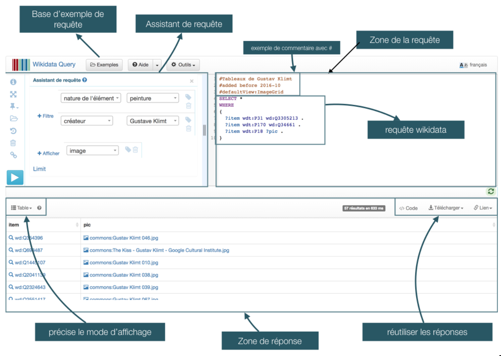

## Tutoriel "pas-pas" pour créer un corpus avec wikidata
réalisé dans le cadre du workshop “fabriquer des jeux de données en art” du 28 au 30 mai 2018 à l'INHA

> **Important avant toute chose** : si on ne trouve pas dans WD tous les éléments dont on a besoin pour sa recherche, alors il convient d’enrichir les données directement dans WD !

